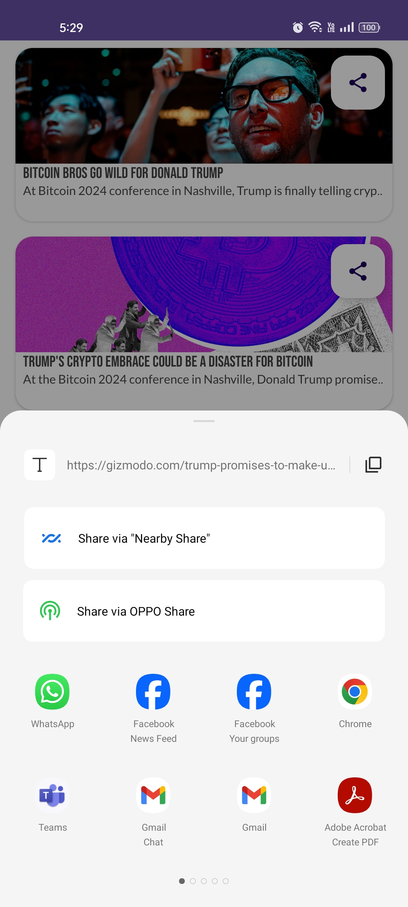

# Bitcoin News
news app built by kotlin and android SDK for android applications 

# This app demonstrates fundamental Android development concepts including:
- User interface creation with XML layouts
- using list item
- recycler viwes
- adapter
- dialog
- intents
- API by retrofit2
- using News API from newsapi.org

# Key features:
gather all articals and news related to Bitcoin in one place and all you to share it whenever you want

# App Snapshots

